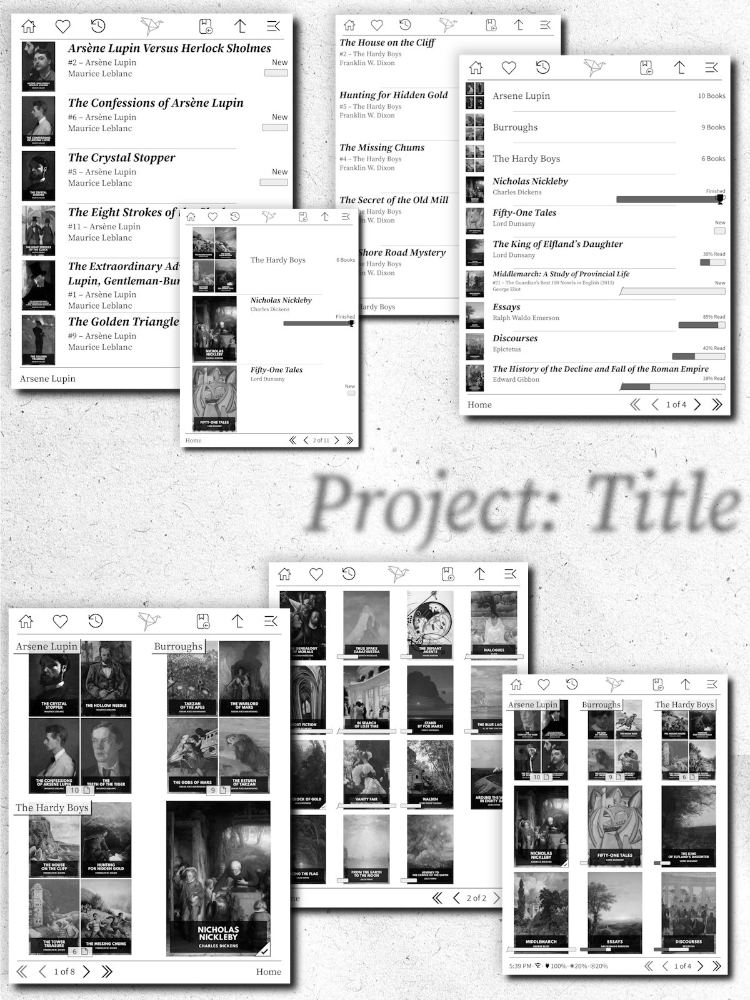

 
এখানে KOReader-এর সাথে Project: Title ইনস্টল করা অবস্থার একটি কোলাজ (collage) দেখানো হয়েছে, যা বিভিন্ন ধরণের ডিসপ্লে সেটিংস প্রদর্শন করে। 
ব্যবহৃত বইগুলো Standard Ebooks কালেকশন থেকে নেওয়া হয়েছে এবং দৃশ্যমান টেক্সটটি তাদের কাভার ডিজাইনের অংশ, যা এই প্লাগইন দ্বারা ওভারলে করা হয়নি। 

#### KOReader-এর জন্য একটি নতুন ভিউ (Cover Browser-এর উপর ভিত্তি করে)
Project: Title এমন দুজন ব্যক্তির প্রজেক্ট যারা KOreader পছন্দ করেন কিন্তু Cover Browser প্লাগইনটি আরও উন্নত করতে চেয়েছিলেন। আমরা এমন একটি ইন্টারফেস চেয়েছিলাম যা কমার্শিয়াল ইরিডার (eReaders) গুলোর সাথে মানানসই হয়। এমন কিছু যা পরবর্তী বই খোঁজার সময়টিকে যতটা সম্ভব আনন্দদায়ক করে তোলে।

## বৈশিষ্ট্যসমূহ (Features)
* **দ্রুতগতির টাইটেল বার**: আরও চিকন এবং বেশি কার্যকর — এতে ফেভারিটস (Favorites), হিস্ট্রি (History), সর্বশেষ পড়া বই খোলা (Open Last Book) এবং আপ ফোল্ডার (Up Folder) বাটন যোগ করা হয়েছে, যা আপনাকে দ্রুত কাঙ্ক্ষিত জায়গায় পৌঁছাতে সাহায্য করে।

* **একটি নতুন বুক লিস্টিং**: নতুন ফন্ট, নতুন টেক্সট এবং কাভার ছাড়া ও অসমর্থিত (unsupported) ফাইলের জন্য নতুন আইকন। একটি [ঐচ্ছিক (optional)](../../wiki/Configure-Calibre-Page-Counts) প্রোগ্রেস বার যা শুধুমাত্র শতকরা হারের বদলে প্রতিটি বইয়ের তুলনামূলক দৈর্ঘ্য নির্দেশ করে। বইগুলো আকর্ষণীয় ও ভিন্নভাবে সাজানো হয়েছে, যা স্ক্রিনের আকার এবং কতগুলো আইটেম আছে তার সাথে মানিয়ে নেয়।

* **সুন্দর ফোল্ডার**: ফোল্ডারের নামে আর স্ল্যাশ (slashes) দেখা যায় না, বরং আপনি আপনার পছন্দমতো কাভার ইমেজ, থাম্বনেইল বা সাধারণ একটি আইকন দেখতে পাবেন। ফোল্ডারের এক ধাপ উপরে যাওয়ার অ্যারো (arrow) বাটনটি টাইটেল বারে স্থানান্তর করা হয়েছে, যাতে বইগুলো দেখানোর জন্য বেশি জায়গা পাওয়া যায়।

* **তথ্যবহুল ফুটার (Footer)**: পেজ কন্ট্রোল এবং আপনার পছন্দমতো বর্তমান ফোল্ডার বা ডিভাইসের স্ট্যাটাস বার দেখায়, যেখানে সময়, ওয়াই-ফাই (wifi), ব্যাটারি এবং ফ্রন্টলাইটের (frontlight) স্ট্যাটাস থাকে। পেজ কন্ট্রোলের অবস্থানটি নিচের ডানদিকে বা বামদিকে সেট করা যায়।

* **ম্যাচিং বুক স্ট্যাটাস পেজ**: ডিফল্ট বুক স্ট্যাটাস পেজটি (যা স্ক্রিনসেভার হিসেবে পাওয়া যায়) আপডেট করা হয়েছে, যাতে বইয়ের বর্ণনা এবং আপনার পড়ার প্রোগ্রেস দেখা যায়। এর ডিজাইনটিও নতুন বুক লিস্টিংয়ের সাথে মানানসই করে তৈরি করা হয়েছে। প্রয়োজন হলে পুরনো স্ট্যাটাস পেজে ফিরে যাওয়ার একটি সেটিংও রয়েছে।

* **আরও কিছু চমৎকার ফিচার**: ইউএসবি (USB) খোলার পর নতুন বই স্বয়ংক্রিয়ভাবে স্ক্যান (Autoscan) করা, জেসচার (pinch/spread) ব্যবহার করে লিস্ট ও গ্রিডের আইটেমগুলো বড়-ছোট করা, পড়া শেষ করা বই চিহ্নিত করতে একটি ট্রফি আইকন এবং আরও অনেক কিছু।

## এটি কাদের জন্য (Who this (hopefully) is for):
* কোবো (Kobo) ডিভাইস ব্যবহারকারীদের জন্য। আমরা এটি দুটি কোবোতে (Aura One, Sage) ডিজাইন করেছি, তাই আমরা এর অভিজ্ঞতা নিয়ে বেশ আত্মবিশ্বাসী।
* জেলব্রেক করা কিন্ডল (Kindle) ব্যবহারকারীদের জন্য। 2025.04v1 সংস্করণ থেকে এটি সাপোর্ট করে এবং আমরা অনেক কিন্ডল ব্যবহারকারীকে এই প্লাগইন চালাতে দেখেছি ও তাদের রিভিউ শুনেছি।
* অ্যান্ড্রয়েড (Android) ব্যবহারকারীদের জন্য। 2025.04v2 সংস্করণ থেকে KOReader-এর অ্যান্ড্রয়েড সংস্করণও সমর্থিত।
* পকেটবুক (Pocketbook), বুক্স (Boox), বিগমি (Bigme) এবং অন্যান্য ডিভাইসের ব্যবহারকারীরাও এখন এটি ভালোভাবে ব্যবহার করতে পারবেন। (কোনো সমস্যা হলে আমাদের জানাবেন।)
* ক্যালিব্রে (Calibre) ব্যবহারকারীদের জন্য। আমরা উভয়েই ক্যালিব্রে দিয়ে বই সিঙ্ক করি, এবং অন্তত একটি ফিচার (বইয়ের দৈর্ঘ্যের প্রোগ্রেস বার) ক্যালিব্রে ও এর একটি প্লাগইনের উপর নির্ভরশীল।
* গোছানো EPUB/PDF লাইব্রেরি আছে এমন ব্যক্তিদের জন্য। আমরা নিশ্চিত করি যে আমাদের সিঙ্ক করা প্রতিটি EPUB এর টাইটেল, লেখক, সিরিজ এবং কাভার ইমেজ থাকে, তাই আমরা এমনভাবে ডিজাইন করেছি যাতে বইয়ের সব মেটাডেটা থাকে।
* যারা পরবর্তী বই খোঁজার সময় ব্রাউজ করতে ভালোবাসেন এবং বই শুরু করার আগে সেটি কতো বড় তা দেখতে চান তাদের জন্য।

## এটি কাদের জন্য নয় (Who this (probably) is not for):
* যারা খুব সাধারণ (barebones) UI পছন্দ করেন। আপনি যদি শুধুমাত্র ফাইলের নামের তালিকা থেকে আপনার পরবর্তী বই বেছে নিতে খুশি হন, তবে KOReader আগে থেকেই এটি খুব ভালোভাবে করতে পারে! তবে 2025.08v3.5 সংস্করণ থেকে একটি "filenames only" ডিসপ্লে মোড যুক্ত করা হয়েছে, যদি আপনি প্লাগইনের অন্যান্য দিকগুলো ব্যবহার করতে চান।
* যারা Cover Browser থেকে বাদ দেওয়া কোনো নির্দিষ্ট ফিচার খুব ভালোবাসেন। আমরা আমাদের নিজেদের জন্য কিছু যোগ এবং কিছু বাদ দিয়ে এই প্লাগইন তৈরি করেছি। আমরা খুব বেশি কিছু বাদ দিইনি, কিন্তু আমাদের বাদ দেওয়া বা পরিবর্তন করা কোনো কিছু কারও অভাব মনে হতেই পারে।

## ইনস্টলেশন এবং নির্দেশিকা (Installation & Instructions)
**ডাউনলোডের জন্য:** [Releases Page](../../releases) এ যান এবং Project: Title এর সেই সংস্করণটি খুঁজে নিন যা আপনার ব্যবহার করা KOReader সংস্করণের সাথে হুবহু মিলে যায়। সব KOReader সংস্করণ সমর্থিত নয় বা হবে স্টেশন হবে না। আপনি যদি KOReader আপগ্রেড করেন, তবে আপনাকে Project: Title ও আপগ্রেড করতে হবে, এবং যদি সেই সংস্করণের জন্য Project: Title এর কোনো আপডেট না থাকে, তবে এটি লোড হওয়া বন্ধ হয়ে যাবে। তখন আপনাকে KOReader ডাউনগ্রেড করা বা আমাদের আপডেটের জন্য অপেক্ষা করার মধ্যে কোনো একটি বেছে নিতে হবে।

**আপনার ইরিডারে প্লাগইন ইনস্টল করার জন্য:**
[ইন্সটলেশন উইকি পেজ (Installation Wiki Page)](../../wiki/Installation)

**বইয়ের পৃষ্ঠা সংখ্যা যোগ করতে ক্যালিব্রে (Calibre) কনফিগার করার জন্য:**
[ক্যালিব্রে পেজ কাউন্ট উইকি পেজ (Calibre Page Counts Wiki Page)](../../wiki/Configure-Calibre-Page-Counts)

**ডকুমেন্টেশন (লুকানো টাইটেল বার ফাংশনসহ!)**
[Project: Title ডকুমেন্টেশন](../../wiki/Documentation)

**প্লাগইন আনইনস্টল করার জন্য:** Project: Title নিষ্ক্রিয় করতে প্লাগইন মেনু খুলুন এবং পুনরায় Cover Browser চালু করে আপনার ডিভাইস রিস্টার্ট করুন। এছাড়াও আপনি আপনার ডিভাইস থেকে projecttitle.koplugin ফোল্ডারটি মুছে ফেলতে পারেন। এরপর আপনি অতিরিক্ত ফন্ট এবং আইকনগুলোও ডিলিট করতে পারেন, সেগুলো কোথায় রেখেছিলেন তা মনে করতে ইনস্টল করার ধাপগুলো দেখে নিতে পারেন।

## ক্রেডিটস (Credits)
এখানকার সমস্ত কোড প্রথমে Cover Browser প্লাগইন হিসেবে শুরু হয়েছিল, যা @poire-z এবং KOReader টিমের অন্যান্য সদস্যরা লিখেছেন। এখানে করা অতিরিক্ত পরিবর্তনগুলো @joshuacant এবং @elfbutt করেছেন।

## লাইসেন্স (Licenses)
এই কোডটি KOReader এর মতো একই শর্তে লাইসেন্সকৃত, যা হলো AGPL-3.0। অতিরিক্ত যেকোনো ফাইলের (ফন্ট, ইমেজ ইত্যাদি) লাইসেন্স সম্পর্কিত তথ্য licenses.txt ফাইলে দেওয়া আছে।
